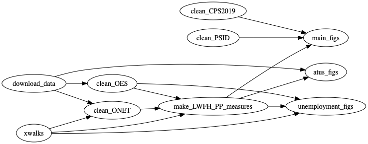

This repository contains the code which replicates "[How Many Jobs Can be Done at Home?](Mongey_Pilossoph_Weinberg_Work_from_home_April_2020.pdf)" by Simon Mongey, Laura Pilossoph, and Alex Weinberg. 
This replication package downloads the data available online and reproduces the results available in our paper.

## Work-from-home measures

The following data on occupation work-from-home ability and physical-proximity may be useful for your research:
- [2 digit Census OCC](files/lwfh_pp_occ_2digit.csv)
- [3 digit Census OCC](files/lwfh_pp_occ_3digit.csv)

## Source data

We use publicly available data from:
- [O\*NET](https://www.onetcenter.org/)
- [OES](https://www.bls.gov/oes/home.htm)
- [ATUS](https://www.bls.gov/tus/)
- [CPS](https://www.bls.gov/cps/)
- [PSID](https://psidonline.isr.umich.edu/)

- O\*NET, OES, and ATUS files
	- Downloaded in the process of running the replication. 
- CPS files:
	- 2019 ASEC is downloaded from [IPUMS](https://cps.ipums.org/cps/) and can be found here `clean_CPS2019/input/asec19_raw.dta`
	- The basic monthly CPS is downloaded from [IPUMS](https://cps.ipums.org/cps/)
		- Sample is February and March from 2010 - 2010
		- We keep a subset of variables (see end of this note) 
		- The replication code then loads in the files `unemployment_figs/input/basic_monthly_CPS_raw_YYYY.dta` 
- PSID files:
	- Downloaded FAM2017ER from [PSID](https://simba.isr.umich.edu/Zips/ZipMain.aspx)
	- We keep a subset of variables (see end of this note) 
	- The replication code then loads in the file `clean_PSID/input/htm_psid2017.dta`
- The [Safegraph](https://docs.safegraph.com/docs/social-distancing-metrics) data we use in the paper is not publicly available.

## Replication instructions

### Download and run code

1. Download this repository by clicking the green `Clone or download` button above. Unzip into the directory of your choice. 
2. From the terminal, navigate to the folder containing this README. 
3. Type `make` and hit `enter` to excute the code from top to bottom. The `Makefile` will execute all the `stata` and `shell` scripts.

### Alternative way to run code

The best way to replicate the paper is to run `make`. 
It is also possible to replicate the paper by running the scripts found in the folders in the following order:

1. `download_data/src`
2. `clean_ONET/src`
3. `clean_OES/src`
4. `clean_PSID/src`
5. `make_LWFH_PP_measures/src`
6. `clean_CPS2019/src`
7. `main_figs/src`
8. `unemployment_figs/src`
9. `atus_figs/src`

## Code organization

The workflow is organized as a series of tasks.
Each task folder contains three folders: `input`, `src`, `output`.
A task's output is used as an input by one or more downstream tasks.

### See also

- Jonathan Dingel's [note](https://tradediversion.net/2019/11/06/why-your-research-project-needs-build-automation/) on the automated task-based organization of this code. 
- The replication package for [Dingel and Neiman 2020](https://github.com/jdingel/DingelNeiman-workathome) has helpful notes on running `make` and `stata`. 

## Variables kept from CPS and PSID

### Basic Monthly CPS

Sample is February & March from 2010 - 2020.

Variables
- age 
- occ 
- educ 
- empstat 
- compwt 
- month 
- year 
- marst 
- earnweek 
- uhrswork1 
- bpl 
- citizen
- race 
- sex 
- labforce

### PSID

From the PSID’s [Main Study Family File 2017](https://simba.isr.umich.edu/Zips/ZipMain.aspx).

- ER66002 
- ER66009
- ER66017
- ER71331
- ER71333
- ER71335
- ER71347
- ER71349
- ER71351
- ER71353
- ER71305
- ER71377
- ER71363
- ER71361
- ER71365
- ER71277
- ER71427
- ER71429
- ER71433
- ER71435 
- ER71437
- ER71439
- ER71443
- ER71445
- ER71447
- ER71449
- ER71451
- ER71453
- ER71455
- ER71457
- ER71459
- ER71461
- ER71463
- ER71465
- ER71467
- ER71469
- ER71471
- ER71473 
- ER71475
- ER71481
- ER71483
- ER71485 
- ER71570 
- ER71512
- ER66195
- ER66196
- ER66197 

